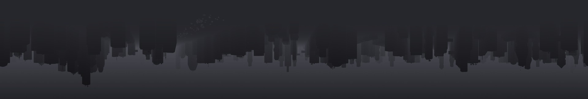

```
░▒▓███████▓▒░ ░▒▓██████▓▒░░▒▓███████▓▒░ ░▒▓██████▓▒░    Status      | Intern, Student
░▒▓█▓▒░░▒▓█▓▒░▒▓█▓▒░░▒▓█▓▒░      ░▒▓█▓▒░▒▓█▓▒░░▒▓█▓▒░   Focus       | Full-Stack, Systems
░▒▓█▓▒░░▒▓█▓▒░▒▓█▓▒░░▒▓█▓▒░      ░▒▓█▓▒░▒▓█▓▒░░▒▓█▓▒░   Languages   | Python, TypeScript, C++, Java
░▒▓█▓▒░░▒▓█▓▒░▒▓████████▓▒░░▒▓██████▓▒░ ░▒▓███████▓▒░   Frameworks  | React, SpringBoot, FastAPI
░▒▓█▓▒░░▒▓█▓▒░▒▓█▓▒░░▒▓█▓▒░▒▓█▓▒░             ░▒▓█▓▒░   –––––––––––––––––––––––––––––––––––––––––––––
░▒▓█▓▒░░▒▓█▓▒░▒▓█▓▒░░▒▓█▓▒░▒▓█▓▒░             ░▒▓█▓▒░   Learning    | C++, Operating Systems, Neovim
░▒▓█▓▒░░▒▓█▓▒░▒▓█▓▒░░▒▓█▓▒░▒▓████████▓▒░░▒▓██████▓▒░    Reading     | OSTEP, Klara and the Sun
```

<!--  -->
